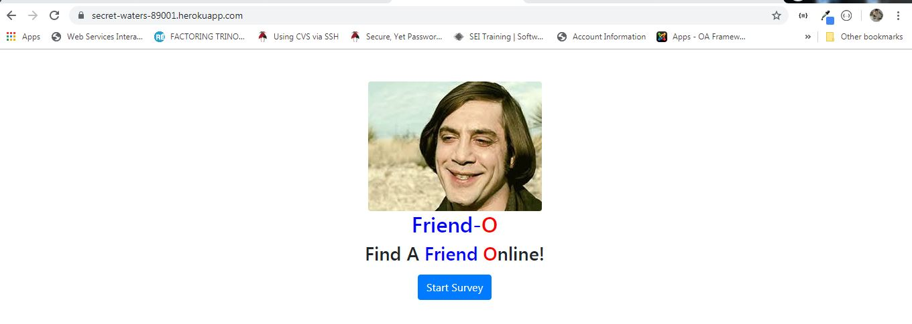
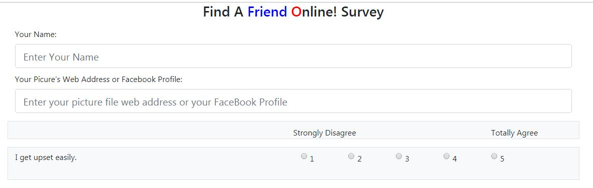
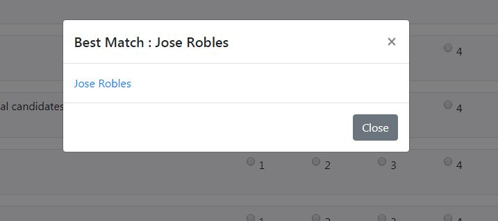

# FriendFinder
UCF Bootcamp Week 12 Homework.
Express JS & Routing

# Contents

 * [Overview](#overview)

 * [How To Run](#howToRun)
 
 * [File Structure](#FileStructure)
 
 * [Technologies Used](#techsUsed)
 
  * [Support](#support)
 
 
### Overview <a name="overview"></a>
FriendFinder is a simple web app to showcase using ExpressJS to create the middleware needed to handle routing in a web application. 
The application will allow the user to fill a simple survey and based on the answers provided, match him/her with one of the previous survey responders, by computing how close their "scores" are. 

### How To Run <a name="howToRun"></a>
The application has been deployed to Heroku and is accessible [here](https://secret-waters-89001.herokuapp.com)
Upon arriving at the page, the following page is shown:

The user clicks on the "Start Survey" button to access the "Survey" form.
In the survey form, the user fills out their name, and a link to the URL for their picture.

Each question has 5 radio checkboxes, where  1 = Strongly Disagree with the question posed and 5 = Strongly agree with the question posed. 
The user then clicks the "Find Friend" button, and the application does its magic, finding a matching friend in the list of people previously stored in the program's memory. 



### File Structure <a name="FileStructure"></a>
```
+-+.gitignore -- Files to be ignored by git (node packages and such).
  |
  + README.md -- (This file)
  |
  + app -+
  |      |
  |      + - data -+
  |      |         | 
  |      |         + friends.js -- Contains an initial list of people.
  |      |         |
  |      |         + questions.js -- Contains the questions to present in the survey. 
  |      |
  |      + - javascript -+
  |      |               |
  |      |               + survey.js -- Front-end logic for the survey.html form
  |      |         
  |      + - public -+ 
  |      |           |
  |      |           + friendo.jpg -- Image file
  |      |           + home.html   -- Home page in html
  |      |           + style.css   -- CSS file
  |      |           + Survey.html -- HTML for Survey page
  |      |
  |      + - routing -+
  |                   |
  |                   + apiRoutes.js -- ExpressJS code for API routes.
  |                   |
  |                   + htmlRoutes.js -- ExpressJS code for HTML routes. 
  |
  + package.json -- Application package file in json format.
  |
  + package-lock.json	-- Created by npm -init
  |
  + package.json  -- Created by npm -init
  |
  + server.js + -- Logic for the main server.
  |
  + FriendFinder1.JPG -- Image file to include in README.md
  |
  + FriendFinder2.JPG -- Image file to include in README.md
  |
  + FriendFinder3.JPG -- Image file to include in README.md
```

### Technologies Used <a name="techsUsed"></a>

FriendFinder is built using javascript and runs in the node.js engine.  It has various dependencies:

* npm package 'Express' for handling path routing (URLs) for the application.
* node 'path' module:  provides utilities for working with file and directory paths.
* node 'fs' module: for file operations.

### Support <a name="support"></a>
  If you have any issues installing or using the app, send me a notification at [engjoserobles@gmail.com](mailto:engjoserobles@gmail.com)
  
